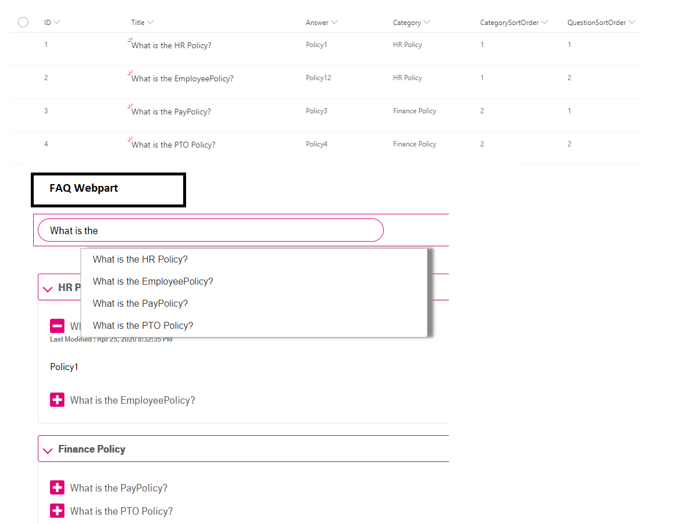

copy of: https://github.com/pnp/sp-dev-fx-webparts/tree/master/samples/react-faqapp
# Frequently Asked Questions App
## Update
- The layout has been change. 
- Add the ability to navigate through the faq using keybord.
- Adding french text to the list.
- Now, the faq work with a different sharepoint list(see below).
## Summary
- This Web Part allows users to create Frequently Asked Questions (FAQ App) in modern and classic SharePoint pages.
- This webpart allows users to search within questions and answers which are stored in a SharePoint FAQ list.
- "React-autosuggest and react-accessible-accordion" react packages are used for the search and accordion control.

## Used SharePoint Framework Version 

## Applies to

* [SharePoint Framework](https://docs.microsoft.com/sharepoint/dev/spfx/sharepoint-framework-overview)
* [Office 365 tenant](https://docs.microsoft.com/sharepoint/dev/spfx/set-up-your-development-environment)

## Solution

Solution|Author(s)
--------|---------
react-FAQApp | Ashok Swain - LinkedIn: https://www.linkedin.com/in/ashok-kumar-swain-2627a514
react-FAQApp | Abderahman Moujahid

## Version history

Version|Date|Comments
-------|----|--------
1.0.0 | April 25, 2020 | Initial release
1.0.1 | October 30, 2020 | Fix limit 100 items

## Disclaimer

**THIS CODE IS PROVIDED *AS IS* WITHOUT WARRANTY OF ANY KIND, EITHER EXPRESS OR IMPLIED, INCLUDING ANY IMPLIED WARRANTIES OF FITNESS FOR A PARTICULAR PURPOSE, MERCHANTABILITY, OR NON-INFRINGEMENT.**

## Minimal Path to Awesome

- `git clone` the repo
- `npm i`
- `npm i -g gulp`
- `gulp serve`

### Local Mode

A browser in local mode (localhost) will be opened.
`https://localhost:4321/temp/workbench.html`

### SharePoint Mode

If you want to try on a real environment, open:
`https://[your-domain].sharepoint.com/_layouts/15/workbench.aspx`

## Usage

- Create a FAQ List in SharePoint.
- Create the below fields:

Column Name|Field Type
-------|----
`QuestionEN`|Single line of text
`QuestionFR`|Single line of text
`AnswerEN`|Multiple lines of text
`AnswerFR`|Multiple lines of text
`CategoryNameEN`|Single line of text
`CategoryNameFR`|Single line of text
`CategorySortOrder`|Number
`QuestionSortOrder`|Number

- Edit the webpart, set the  **ListName** in the property pane 

## Features

- This Web Part allows users to create Frequently Asked Questions (FAQ App) in modern and classic SharePoint pages.
- An accordion layout is used to make it easy to browse through different questions.
- Expand answers to your most frequent questions.
- Include text, links, images in your answers.
- A search bar to make your FAQ accordion searchable.
- This webpart allows users to search within questions and answers which are stored in a SharePoint FAQ list.
- Sorting is enabled on both the category & Question

---

copie de: https://github.com/pnp/sp-dev-fx-webparts/tree/master/samples/react-faqapp
# Application de foire aux questions (FAQ)
## Mise à jour
- La mise en page a été modifiée.
- Il est désormais possible de naviguer dans la FAQ à l’aide d’un clavier.
- Du texte en français a été ajouté à la liste.
- La FAQ fonctionne maintenant avec une liste SharePoint différente (voir ci-
dessous).
## Résumé
- Ce composant WebPart permet aux utilisateurs de créer une foire aux questions
(application de FAQ) dans des pages SharePoint modernes et classiques.
- Il permet également de faire des recherches dans les questions et réponses
conservées dans une liste de FAQ SharePoint.
- Les trousses de réaction « react-autosuggest » et « react-accessible-accordion »
sont utilisées pour la recherche et le contrôle de l’accordéon.

## Version de cadre SharePoint utilisée

## S’applique à ce qui suit :

* [SharePoint Framework](https://docs.microsoft.com/sharepoint/dev/spfx/sharepoint-framework-overview)
* [Office 365 tenant](https://docs.microsoft.com/sharepoint/dev/spfx/set-up-your-development-environment)

## Solution

Solution|Autheur(s)
--------|---------
react-FAQApp | Ashok Swain - LinkedIn: https://www.linkedin.com/in/ashok-kumar-swain-2627a514
react-FAQApp | Abderahman Moujahid

## Historique des versions

Version|Date|Commentaires
-------|----|--------
1.0.0 | 25 avril 2020 | Version initiale
1.0.1 | 30 octobre 2020 | Fixer la limite à 100 éléments

## Avertissement

**LE PRÉSENT CODE EST FOURNI TEL QUEL SANS GARANTIE D’AUCUNE SORTE, EXPRESSE OU IMPLICITE, Y COMPRIS LES GARANTIES IMPLICITES D’ADAPTATION À UN USAGE PARTICULIER, DE QUALITÉ MARCHANDE OU D’ABSENCE DE CONTREFAÇON.**

## Chemin minimal vers l’excellence

- `git clone`
- `npm i`
- `npm i -g gulp`
- `gulp serve`

### Mode local

Un navigateur en mode local (localhost) s’ouvre.
`https://localhost:4321/temp/workbench.html`

### Mode SharePoint

Si vous voulez l’essayer dans un environnement réel, ouvrez:
`https://[votre-domaine].sharepoint.com/_layouts/15/workbench.aspx`

## Utilisation

- Créez une liste de FAQ dans SharePoint.
- Créez les champs suivants :

Nom de la colonne|Type de champ
-------|----
`QuestionEN`|Une seule ligne de texte
`QuestionFR`|Une seule ligne de texte
`AnswerEN`|Plusieurs lignes de texte
`AnswerFR`|Plusieurs lignes de texte
`CategoryNameEN`|Une seule ligne de texte
`CategoryNameFR`|Une seule ligne de texte
`CategorySortOrder`|Nombre
`QuestionSortOrder`|Nombre

- Modifier le composant WebPart et définir le champ « ListName » dans la fenêtre
des propriétés.

## Fonctionnalités

- Ce composant WebPart permet aux utilisateurs de créer une foire aux questions
(application de FAQ) dans des pages SharePoint modernes et classiques.
- Une disposition en accordéon est utilisée pour faciliter la navigation parmi les
différentes questions.
- Développez les réponses à vos questions les plus fréquentes.
- Incluez du texte, des liens et des images dans vos réponses.
- Une barre de recherche pour rendre votre FAQ interrogeable.
- Ce composant WebPart permet également de faire des recherches dans les
questions et réponses conservées dans une liste de FAQ SharePoint.
- Le tri est activé pour la catégorie et la question.

