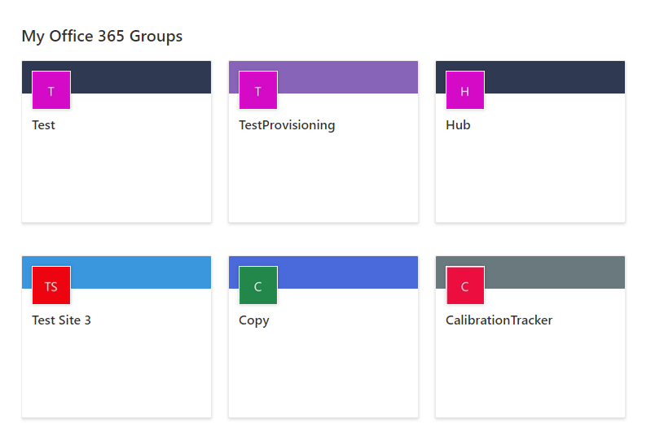
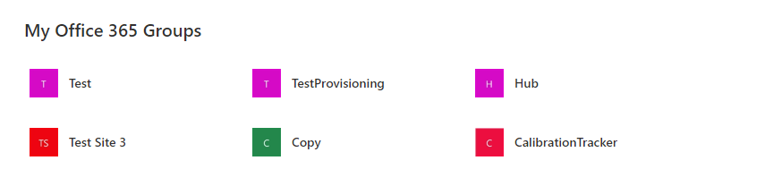
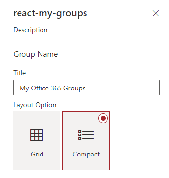

copy of: https://github.com/pnp/sp-dev-fx-webparts/blob/master/samples/react-my-groups

# My Groups
## Update
- Option to show all groups, this will show 20 groups at the time (with pagination).
- New link available to redirect at a specific page for the creation of the group.
- You can choose the number group to display in the setting.
- If the user have more group, see all button will show. In the setting, a input is available for the see all link.
- Ability to sort by creation date or alphabitical.
- French as been add.
- Available in full-with layout.
- New List style layout available.

## Summary

Using Microsoft Graph, this webpart grabs the Office 365 groups the current user is a member of with links to the groups' SharePoint site.

The webpart has been updated to include a grid style layout, in addition to the compact layout as seen below:

Compact Layout:

You can change between the grid and compact layout through the settings in the property pane:

## Used SharePoint Framework Version

## Applies to

* [SharePoint Framework](https://docs.microsoft.com/sharepoint/dev/spfx/sharepoint-framework-overview)

## Solution

Solution|Author(s)
--------|---------
react-my-groups | Zach Roberts

## Version history

Version|Date|Comments
-------|----|--------
1.0|September 13, 2019|Initial release
1.1|June 1, 2020| Updated to SPFX 1.10.0
1.2|July 8, 2020| Added Grid Layout

## Disclaimer

**THIS CODE IS PROVIDED *AS IS* WITHOUT WARRANTY OF ANY KIND, EITHER EXPRESS OR IMPLIED, INCLUDING ANY IMPLIED WARRANTIES OF FITNESS FOR A PARTICULAR PURPOSE, MERCHANTABILITY, OR NON-INFRINGEMENT.**

---

## Minimal Path to Awesome

* Clone this repository
* in the command line run:
  * `npm install`
  * `gulp bundle --ship`
  * `gulp package-solution --ship`
* Add the package to your app catalog
* Approve the Graph API permissions in the SharePoint admin center
* Add the webpart to your page

## Features

This web part lists the current user's Office 365 groups with links to the  group's SharePoint site.

---

copie de: https://github.com/pnp/sp-dev-fx-webparts/blob/master/samples/react-my-groups

# Mes groupes
## Mise à jour
- Ajout de l'option de voir tous les groupes. Ceci permet de voir 20 groupes à la fois, avec une pagination.
- Nouveau lien disponible pour rediriger l'utilisateur vers une page spécifique pour la création d'un groupe.
- Vous pouvez choisir le nombre de groupes à afficher dans les paramètres.
- Si l’utilisateur a plus de groupes, un bouton Afficher tout apparaît pour permettre l’affichage. Dans la section paramètre, un champ est disponible pour ajouter le lien au bouton Afficher tout.
de tous les groupes de l’utilisateur.
- Il est possible de trier les groupes par date de création ou par ordre alphabétique.
- Le français a été ajouté.
- La page est disponible en pleine largeur.
- Nouvelle disposition de style Liste disponible.

## Résumé

À l’aide de Microsoft Graph, ce composant WebPart affiche les groupes Office 365 dont l’utilisateur actuel est membre avec des liens vers le site SharePoint de chaque groupe.

Le composant WebPart a été mis à jour pour inclure une disposition en grille, en plus de la disposition compacte, comme indiqué ci-dessous :

Disposition compacte :

Vous pouvez faire passer la disposition de grille à compacte à l’aide des paramètres de la fenêtre des propriétés :

## Version de cadre SharePoint utilisée

## S’applique à ce qui suit :

* [SharePoint Framework](https://docs.microsoft.com/sharepoint/dev/spfx/sharepoint-framework-overview)

## Solution

Solution|Autheur(s)
--------|---------
react-my-groups | Zach Roberts

## Historique des versions

Version|Date|Commentaires
-------|----|--------
1.0|13 septembre 2019|Version initiale
1.1|1er  juin 2020| Mise à jour vers SPFX 1.10.0
1.2|8 juillet 2020| Ajout de la disposition de grille

## Disclaimer

**LE PRÉSENT CODE EST FOURNI *TEL QUEL* SANS GARANTIE D’AUCUNE SORTE, EXPRESSE OU IMPLICITE, Y COMPRIS LES GARANTIES IMPLICITES D’ADAPTATION À UN USAGE PARTICULIER, DE QUALITÉ MARCHANDE OU D’ABSENCE DE CONTREFAÇON.**

---

## Chemin minimal vers l’excellence

* Clonez ce dépôt
* dans l’exécution de ligne de commande :
  * `npm install`
  * `gulp bundle --ship`
  * `gulp package-solution --ship`
* Ajoutez la trousse à votre catalogue d’applications.
* Approuvez les autorisations du Graph API dans le centre d’administration SharePoint.
* Ajoutez le composant WebPart à votre page.

## Fonctionnalités

Ce composant WebPart répertorie les groupes Office 365 actuels de l’utilisateur avec des liens vers le site SharePoint de chaque groupe.

