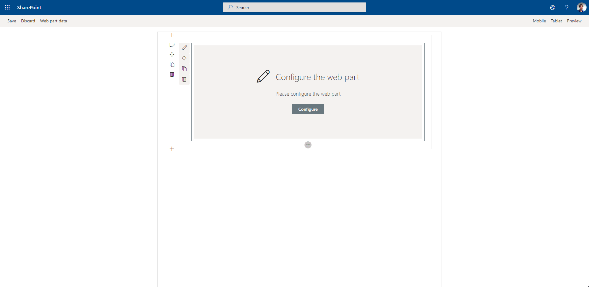

copy of: https://github.com/pnp/sp-dev-fx-webparts/tree/master/samples/react-personal-greeting
# react-personal-greeting

## Update

Can also modifie the background color and the greeting text can be add in french and english.

## Summary

The web part pulls in the current user's name and displays it on the page. The greeting text before the name is customizable through the property pane. Additionally the position of the greeting and color of the text can be adjusted through the property pane as well.

## Used SharePoint Framework Version

## Applies to

* [SharePoint Framework](https://docs.microsoft.com/sharepoint/dev/spfx/sharepoint-framework-overview)
* [Office 365 tenant](https://docs.microsoft.com/sharepoint/dev/spfx/set-up-your-development-environment)
* [PnP SPFx Controls](https://sharepoint.github.io/sp-dev-fx-controls-react)
* [PnP SPFx Property Controls](https://sharepoint.github.io/sp-dev-fx-property-controls)

## Prerequisites

## Solution

Solution|Author(s)
--------|---------
react-personal-greeting|Zach Roberts - [SPODev](https://spodev.com)

## Version history

Version|Date|Comments
-------|----|--------
1.1|September 24, 2020| Updated SPFX version and added font-size
1.0|April 14, 2020|Initial release

## Disclaimer

**THIS CODE IS PROVIDED *AS IS* WITHOUT WARRANTY OF ANY KIND, EITHER EXPRESS OR IMPLIED, INCLUDING ANY IMPLIED WARRANTIES OF FITNESS FOR A PARTICULAR PURPOSE, MERCHANTABILITY, OR NON-INFRINGEMENT.**

---

## Minimal Path to Awesome

* Clone this repository
* in the command line run:
  * `npm install`
  * `gulp build`
  * `gulp bundle --ship`
  * `gulp package-solution --ship`
* add the web part to your tenant app store
* add the app to a SharePoint site and then add the web part to the page

## Features

This Web Part illustrates the following concepts on top of the SharePoint Framework:

* Using the SPFx context to gather the current user's display name.
* Adjusting the styles of the component in the web part using the props adjusted through the property pane.
* PnP SPFx Placeholder - This component allows you to have a placeholder visible under certain conditions if your web parts requires some setup.
* PnP SPFx Color Picker - This component adds an awesome color picker to the property pane, great for adjusting colors in your web part.

---

copie de : https://github.com/pnp/sp-dev-fx-webparts/tree/master/samples/react-personal-greeting

## Mise à jour

Vous pouvez également modifier la couleur d’arrière-plan du texte d’accueil et vous pouvez saisir du texte en français et en anglais.

## Résumé

Le WebPart extrait le nom de l’utilisateur actuel et l’affiche sur la page. Le texte d’accueil avant le nom peut être personnalisé dans la fenêtre des propriétés. De plus, la position du message d’accueil et la couleur du texte peuvent également être ajustées au moyen de la fenêtre des propriétés.

 

## Version de SharePoint utilisée

## S’applique à

* [SharePoint Framework](https://docs.microsoft.com/sharepoint/dev/spfx/sharepoint-framework-overview)
* [Office 365 tenant](https://docs.microsoft.com/sharepoint/dev/spfx/set-up-your-development-environment)
* [PnP SPFx Controls](https://sharepoint.github.io/sp-dev-fx-controls-react)
* [PnP SPFx Property Controls](https://sharepoint.github.io/sp-dev-fx-property-controls)

## Conditions préalables

## Solution

Solution|Autheur(s)
--------|---------
react-personal-greeting|Zach Roberts - [SPODev](https://spodev.com)

## Historique des versions

Version|Date|Commentaires
-------|----|--------
1.1|24 septembre 2020| Version du cadre SharePoint (SPFx) mise à jour et ajout de la taille de police
1.0|14 avril 2020|Version initiale

## Avertissement

**LE PRÉSENT CODE EST FOURNI *TEL QUEL* SANS GARANTIE D’AUCUNE SORTE, EXPRESSE OU IMPLICITE, Y COMPRIS LES GARANTIES IMPLICITES D’ADAPTATION À UN USAGE PARTICULIER, DE QUALITÉ MARCHANDE OU D’ABSENCE DE CONTREFAÇON.**

---

## Chemin minimal vers l’excellence

* Clonez ce dépôt
* Dans l’exécution de ligne de commande :
  * `npm install`
  * `gulp build`
  * `gulp bundle --ship`
  * `gulp package-solution --ship`
* Ajouter le WebPart à votre boutique d’applications du tenant :
* Ajouter l’application à un site SharePoint et ajouter ensuite le WebPart à la page.

## Fonctionnalités

Ce WebPart illustre les concepts suivants en plus du cadre SharePoint :

* Utilisation du contexte SPFx pour recueillir le nom d’affichage de l’utilisateur actuel.
* Réglage des styles du composant dans le WebPart à l’aide des propriétés ajustés au moyen de la fenêtre des propriétés.
* Espace réservé prêt à l’emploi du SPFx – ce composant vous permet d’avoir un espace réservé visible dans certaines conditions si vos WebPart nécessitent une configuration.
* Sélecteur de couleurs prêt à l’emploi du SPFx – ce composant ajoute une superbe palette de couleurs au panneau de propriétés, idéale pour ajuster les couleurs dans votre WebPart.

